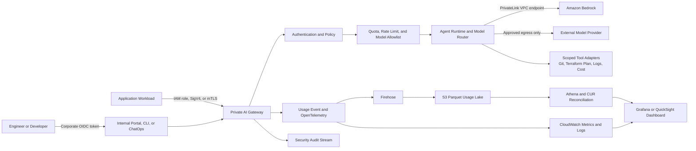

# Enterprise AI Platform and Agent Operations

## Objective

사내 개발자와 workload가 승인된 생성형 AI 모델을 안전하게 사용하고, 이 저장소의 전문 Agent를 실제 업무 흐름에서 명령할 수 있도록 중앙 AI Gateway, Agent Runtime, 사용량 계측, 승인 통제를 정의합니다.

Agent는 독립적으로 production을 변경하는 관리자가 아니라, 중앙 runtime에 등록된 역할별 실행 profile입니다. 모든 요청은 사용자 또는 workload identity, 대상 환경, 허용 도구, token budget, 변경 승인 정보와 함께 처리합니다.

## Target Account and Network Model

- `AI-Platform-Dev` account: prompt, model, tool adapter, dashboard 검증
- `AI-Platform-Prod` account: production AI Gateway와 Agent Runtime
- `Security/Log Archive` account: 변경 불가능한 audit log와 장기 usage data
- Workload accounts: PrivateLink 또는 Transit Gateway를 통해 gateway만 호출
- External model provider가 필요한 경우: 중앙 egress VPC, firewall, TLS policy, domain allowlist를 통과

AI Platform account는 `Infrastructure` OU에 두고, AI 사용 정책과 audit data는 `Security` OU가 통제합니다. 모델 비용은 `CostCenter`, `BusinessUnit`, `Application`, `Environment`, `AgentId` 기준으로 배부합니다.

## Reference Architecture



폐쇄망 workload는 AI provider endpoint를 직접 호출하지 않습니다. Direct Connect 또는 VPN, Transit Gateway, PrivateLink를 통해 내부 AI Gateway를 호출하고, Amazon Bedrock은 `bedrock-runtime` interface VPC endpoint를 사용합니다. 외부 provider는 보안 심사를 통과한 경우에만 gateway의 전용 egress 경로에서 호출합니다.

## AI Gateway Responsibilities

| Control | Implementation |
| --- | --- |
| Authentication | 사람은 Corporate IdP OAuth/OIDC, workload는 IAM role/SigV4 또는 mTLS |
| Authorization | group, application, environment, data classification별 model/tool allowlist |
| Credential isolation | provider credential은 Secrets Manager와 KMS에 보관하고 gateway role만 조회 |
| Routing | use case, latency, region, data policy에 따라 승인된 model로 명시적 routing |
| Usage control | user/team/application별 RPM, TPM, daily token, monthly cost quota |
| Data protection | PII/secret 탐지, prompt size 제한, content policy, egress filtering |
| Reliability | timeout, bounded retry, circuit breaker, provider health check |
| Audit | request ID, principal, model, token, tool call, approval, policy result 기록 |

비용이나 장애를 이유로 다른 model 또는 외부 provider로 자동 전환할 때 데이터 경계가 바뀔 수 있습니다. 따라서 fallback은 동일한 data classification과 region policy를 만족하는 사전 승인 model 사이에서만 허용하고, 정책이 다르면 요청을 실패 처리합니다.

## Agent Runtime Model

각 Agent는 다음 설정을 가진 versioned profile로 등록합니다.

```yaml
agent_id: terraform
profile_version: 1.0.0
allowed_environments: [dev, stg, prod]
allowed_tools: [repository_read, repository_patch, terraform_fmt, terraform_validate, terraform_plan]
denied_tools: [terraform_apply, direct_aws_mutation]
max_input_tokens: 32000
max_output_tokens: 8000
timeout_seconds: 900
approval_policy: prod-plan-review
output_contract: pull-request-or-review-report
```

권한은 Agent 이름이 아니라 매 요청의 사용자 identity, repository, environment, ticket, tool에 대해 교차 검증합니다. Agent profile 변경도 application code와 동일하게 pull request, security review, version pinning을 적용합니다.

Cloud Platform Manager Agent는 cross-domain orchestration profile로 등록하되 `request_read`, `artifact_index`, `routing_plan`, `handoff_write`처럼 조정에 필요한 도구만 허용합니다. Manager가 Terraform, AWS, Kubernetes, CI/CD와 billing tool 권한을 하위 Agent로부터 상속하지 않으며, 전문 Agent 호출마다 해당 profile과 사용자 entitlement를 다시 검증합니다. `ready_for_approval`은 workflow 상태일 뿐 사람 승인 token이 아닙니다.

## Command Channels and Contract

운영 채널:

- Internal portal: 일반 사용자의 표준 요청과 결과 확인
- `agentctl` CLI: 엔지니어가 repository와 environment를 명시해 실행
- Pull request command: plan 분석, 보안 검토, 문서 갱신
- CI/CD API: 정형화된 검증 작업만 service identity로 실행

Monitoring incident에 대해서는 로컬 read-only evidence collector 형태의 `scripts/agent/agentctl.py` MVP가 구현되어 있습니다. 이 MVP는 고정 query catalog와 제한된 adapter를 직접 실행하지만 production target에서는 gateway API를 호출하는 얇은 client로 전환하고 credential, authorization, audit와 network egress는 Tool Broker가 소유합니다. 자세한 현재 범위는 [Read-Only Agent Incident Triage](agent-incident-triage.md)를 따릅니다.

```bash
agentctl run terraform \
  --repository cloud-portfolio \
  --environment dev \
  --mode plan \
  --task "network module에 VPC endpoint 추가" \
  --change-ticket CHG-2026-0042
```

표준 요청 payload:

```json
{
  "agent_id": "terraform",
  "task": "network module에 VPC endpoint 추가",
  "repository": "cloud-portfolio",
  "environment": "dev",
  "mode": "plan",
  "change_ticket": "CHG-2026-0042",
  "data_classification": "internal",
  "max_cost_usd": 2.0
}
```

Gateway는 사용자 입력으로 받은 `user_id`, `role`, `account_id`, `approval` 값을 신뢰하지 않습니다. 인증 token과 server-side entitlement에서 해당 정보를 생성해 실행 context에 주입합니다.

## Agent Permissions and Outputs

| Agent | Runtime access | Allowed output | Production rule |
| --- | --- | --- | --- |
| Architecture | 요구사항, docs, inventory read | ADR, architecture proposal | 문서 변경 PR만 생성 |
| Terraform | repository read/write, fmt/validate/plan | code patch, plan summary | `apply` 금지, 승인된 CI/CD만 배포 |
| Governance | Organizations/SCP read, policy test | SCP proposal, compliance report | management account 직접 변경 금지 |
| Security | IAM/config/log read, scanner | finding, policy patch | 예외 승인 없이 guardrail 완화 금지 |
| Monitoring | metric/log query, dashboard source | alarm/dashboard PR, incident analysis | alarm suppression은 운영자 승인 필요 |
| Operations | inventory/runbook, approved automation | runbook, change proposal | 재시작·중지·복구는 ticket과 human approval 필요 |
| FinOps | CUR, budget, usage read | cost report, quota proposal | 구매·예산 변경은 FinOps owner 승인 필요 |
| CI/CD | workflow source, validation runner | pipeline PR, validation result | protected environment gate 유지 |
| Reviewer | repository and plan read-only | review report, backlog | write 또는 deploy credential 없음 |
| Documentation | approved outputs and docs | README/PDF source PR | secret 또는 raw prompt 포함 금지 |

## Controlled Execution Flow

1. 사용자가 Corporate IdP로 인증하고 Agent, task, repository, environment를 선택합니다.
2. AI Gateway가 group entitlement, data classification, quota, model allowlist를 확인합니다.
3. Agent Runtime은 pinned profile과 read-only context로 작업을 시작합니다.
4. Tool Broker가 각 tool call을 schema validation하고 scoped credential을 실행 시점에만 발급합니다.
5. 코드 변경은 branch 또는 patch로 생성하고 Terraform `fmt`, `validate`, `plan`, policy scan을 수행합니다.
6. Reviewer Agent와 사람이 결과를 검토합니다.
7. `dev`와 `stg` 배포도 승인된 CI/CD role이 수행하며 Agent가 cloud API를 직접 변경하지 않습니다.
8. `prod`는 change ticket, plan artifact hash, designated approver가 모두 일치해야 protected deployment가 시작됩니다.
9. 모든 model 호출, tool call, 승인, 결과 artifact를 동일한 `request_id`와 `trace_id`로 연결합니다.

## Token and Cost Telemetry

Gateway는 provider 응답에서 usage를 수집하고 다음 공통 event schema로 정규화합니다.

```json
{
  "timestamp": "2026-08-07T09:00:00Z",
  "request_id": "req-01J...",
  "trace_id": "trace-01J...",
  "principal_hash": "sha256:...",
  "team": "platform",
  "cost_center": "cloud-platform",
  "application": "agent-runtime",
  "agent_id": "terraform",
  "environment": "dev",
  "provider": "amazon-bedrock",
  "model": "approved-model-alias-v1",
  "input_tokens": 12400,
  "output_tokens": 2100,
  "cached_input_tokens": 6000,
  "latency_ms": 8420,
  "status": "success",
  "policy_result": "allow",
  "estimated_cost_usd": 0.084,
  "price_version": "2026-08-01"
}
```

`principal_hash`는 운영 dashboard에서 개인 식별을 최소화하기 위한 값이며, 보안 조사 권한이 있는 경우에만 별도 identity mapping을 조회합니다. Raw prompt와 response는 기본 usage log에 저장하지 않습니다.

비용 추정식:

```text
estimated_cost =
  input_tokens / 1,000,000 * input_unit_price
  + output_tokens / 1,000,000 * output_unit_price
  + cached_input_tokens / 1,000,000 * cached_unit_price
  + provider_specific_charges
```

가격표는 effective date와 currency를 가진 versioned catalog로 관리합니다. Gateway 계산값은 실시간 추정치이며, 일별로 AWS Cost and Usage Report 또는 provider invoice와 대사해 billing 차이를 보정합니다.

## Dashboard Design

| Dashboard | Primary widgets | Audience |
| --- | --- | --- |
| Executive and FinOps | MTD spend, forecast, budget burn, business unit/application/model 비용 | Platform owner, FinOps |
| AI Platform Operations | request rate, p50/p95 latency, error/throttle rate, input/output token, provider health | SRE, platform engineer |
| Agent Operations | run count, task success, tool failure, approval wait time, plan rejection, agent별 token/task | Agent owner |
| Security and Governance | denied request, PII/secret detection, unapproved model, privileged tool request, data region | Security, audit |
| Team Self-Service | team quota, remaining token, top application, failed request, optimization hints | Developers |

필수 필터는 `time`, `account`, `environment`, `team`, `cost center`, `application`, `agent`, `provider`, `model`, `status`입니다. 개인별 순위 dashboard는 일반 공개하지 않고 비용 조사나 보안 감사 목적의 제한된 view로 분리합니다.

## Collection Pipeline

1. Gateway가 request 완료 시 CloudWatch Embedded Metric Format 또는 OpenTelemetry metric을 기록합니다.
2. 상세 usage event는 CloudWatch Logs 또는 Kinesis Data Firehose로 전달합니다.
3. Firehose가 S3에 날짜/account/team 기준 Parquet partition으로 저장합니다.
4. Glue Data Catalog와 Athena가 usage를 조회하고 CUR 및 model price catalog와 대사합니다.
5. Grafana는 near-real-time latency/error/token metric을, QuickSight 또는 Grafana는 비용·예산 view를 제공합니다.
6. CloudWatch Alarm 또는 Prometheus alert가 quota, spend anomaly, error rate를 SNS와 incident channel로 전달합니다.

Amazon Bedrock model invocation logging은 account와 Region 단위로 CloudWatch Logs 또는 S3에 전달할 수 있지만 request/response 본문 저장은 data classification과 retention 정책에 따라 별도 승인합니다. 중앙 Gateway usage event를 비용과 권한의 기준 데이터로 사용하고 provider log는 대사와 장애 분석에 사용합니다.

## Quota and Alert Baseline

| Control | Initial policy |
| --- | --- |
| User sandbox | Daily token and concurrency limit |
| Team | Monthly USD budget with 50/80/100 percent alert |
| Application | RPM/TPM and maximum context/output token |
| Agent run | Maximum cost, timeout, tool call count |
| Production | Approved model alias only, no automatic external fallback |

초기 경보:

- 5분 error rate 또는 throttle rate가 SLO 초과
- team budget 80 percent 도달 또는 일별 spend anomaly 발생
- 단일 request가 agent max cost를 초과
- unapproved model/provider 또는 restricted data 요청 차단
- privileged tool call이 승인 없이 시도됨
- token count 누락으로 비용을 계산할 수 없는 event 발생

## Data Protection and Retention

- prompt/response body logging은 기본 비활성화합니다.
- troubleshooting sample은 opt-in, redaction, KMS encryption, 접근 승인, 짧은 retention을 적용합니다.
- secret, credential, 주민등록번호, 고객식별정보 등은 gateway 앞단과 tool output에서 탐지·차단합니다.
- provider별 data residency, retention, training use, subprocessors를 model onboarding checklist로 관리합니다.
- vector store와 conversation memory는 workload별 KMS key, tenant boundary, TTL을 적용합니다.
- audit event는 보안 정책에 맞춰 별도 immutable storage에 보관합니다.

## Failure and Recovery

- Gateway 장애 시 application은 bounded retry와 circuit breaker를 사용하고 provider를 직접 우회하지 않습니다.
- Usage event 전송 실패 시 local buffer 또는 queue에 저장하고 request 처리와 billing telemetry 유실을 구분해 경보합니다.
- Provider quota 초과 시 같은 정책 등급의 승인 model로만 fallback하거나 명시적으로 실패합니다.
- Agent tool timeout 이후에는 부분 실행 상태와 생성된 artifact를 보존하고 자동 재실행 전에 idempotency를 확인합니다.
- Gateway 정책과 Agent profile은 versioned artifact로 배포하고 이전 버전으로 rollback할 수 있어야 합니다.

## Terraform Implementation Boundary

향후 다음 모듈 경계를 추가합니다.

```text
terraform/
├── ai-platform/
│   ├── dev/
│   └── prod/
└── modules/
    ├── ai-gateway/
    └── ai-observability/
```

`ai-gateway` 후보 리소스:

- Internal ALB/NLB 또는 private API endpoint
- ECS Fargate 또는 EKS runtime
- Amazon Bedrock interface VPC endpoint와 endpoint policy
- Secrets Manager, KMS, WAF 또는 internal request policy
- SQS/DynamoDB를 사용한 비동기 job과 idempotency

`ai-observability` 후보 리소스:

- CloudWatch Log Group, metric, alarm, dashboard
- Kinesis Data Firehose
- S3 usage lake, lifecycle, Glue Catalog, Athena workgroup
- Grafana 또는 QuickSight data source
- token/cost budget SNS notification

## Adoption Roadmap

1. `dev`에서 gateway를 observe-only로 배치하고 model alias와 usage schema를 확정합니다.
2. SSO 기반 internal portal과 workload identity를 연결하고 token/cost dashboard를 공개합니다.
3. Architecture, Reviewer, Documentation Agent부터 read-only 도구로 운영합니다.
4. Terraform, Security, Monitoring Agent에 repository patch와 validation tool을 단계적으로 허용합니다.
5. `stg`에서 approval, audit, quota, failure recovery를 검증합니다.
6. `prod`는 plan/read-only부터 시작하고 실제 변경은 protected CI/CD와 사람 승인을 유지합니다.

## References

- [Amazon Bedrock interface VPC endpoints](https://docs.aws.amazon.com/bedrock/latest/userguide/vpc-interface-endpoints.html)
- [Amazon Bedrock model invocation logging](https://docs.aws.amazon.com/bedrock/latest/userguide/model-invocation-logging.html)
- [AWS IAM Identity Center external identity providers](https://docs.aws.amazon.com/singlesignon/latest/userguide/manage-your-identity-source-idp.html)
