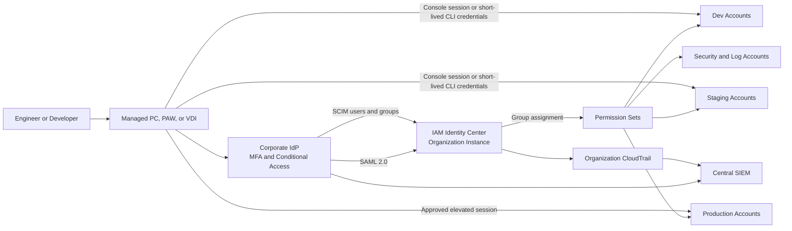

# Enterprise Workforce Identity and AWS Account Access

## Objective

사내 엔지니어와 개발자가 장기 IAM access key를 발급받지 않고 기업 계정으로 인증한 뒤, 승인된 AWS 계정과 역할에만 접근하도록 workforce identity 구조를 정의합니다.

이 문서의 대상은 사람의 AWS Console 및 CLI 접근입니다. CI/CD, 애플리케이션, AI Agent 같은 machine identity는 OIDC federation 또는 IAM role을 사용하며 사람의 SSO 세션을 공유하지 않습니다.

## Recommended Identity Source

기본 선택은 `Corporate IdP -> AWS IAM Identity Center organization instance`입니다.

| Current enterprise identity | Recommended connection | Notes |
| --- | --- | --- |
| Microsoft Entra ID | SAML 2.0 federation + SCIM | Conditional Access, MFA, PIM을 IdP에서 운영 |
| Okta or Ping Identity | SAML 2.0 federation + SCIM | 기존 group과 lifecycle workflow 재사용 |
| On-premises Active Directory | AWS Managed Microsoft AD 또는 AD Connector 연동 검토 | 폐쇄망 DNS, network path, directory HA 필요 |
| No corporate IdP | IAM Identity Center directory | 초기 구축에는 가능하지만 기업 HR lifecycle 연동이 약함 |

하나의 AWS Organizations에는 하나의 identity source만 사용하므로, 폐쇄망별 directory가 여러 개라면 중앙 Corporate IdP에서 identity를 통합하거나 identity broker를 두는 방식을 우선합니다. 통합할 수 없는 강한 분리 요건이 있다면 AWS Organizations 자체를 분리하고 각 organization에 별도 IAM Identity Center를 운영합니다.

## Target Architecture



IAM Identity Center는 AWS Organizations의 management account에 organization instance로 활성화합니다. 일상적인 운영은 `Security` OU의 전용 `Identity` account를 delegated administrator로 지정해 수행하고, management account 접근은 별도의 최소 인원에게만 허용합니다.

## Account and Permission Model

개별 사용자에게 계정을 직접 할당하지 않고 `IdP Group -> Permission Set -> AWS Account` 관계를 코드와 승인 절차로 관리합니다.

| Corporate group | Account scope | Permission set | Session guideline | Approval |
| --- | --- | --- | --- | --- |
| `AWS-Developers` | Assigned `dev` accounts | `Developer` | 4 hours | Team owner |
| `AWS-Staging-Operators` | Assigned `stg` accounts | `StagingOperator` | 2 hours | Service owner |
| `AWS-Prod-Readers` | `prod` accounts | `ProductionReadOnly` | 4 hours | Automatic by job role |
| `AWS-Prod-Operators` | Selected `prod` accounts | `ProductionOperator` | 1 hour | Ticket + JIT approval |
| `AWS-Security-Auditors` | Organization-wide | `SecurityAudit` | 2 hours | Security owner |
| `AWS-Platform-Admins` | Infrastructure accounts | `PlatformAdmin` | 1 hour | Platform owner + MFA |

권한 설계 원칙:

- `prod` 기본 권한은 read-only이며 변경 권한은 ticket과 시간 제한이 있는 JIT group membership으로 승격합니다.
- IAM Identity Center가 각 account에 생성하는 `AWSReservedSSO_*` role을 직접 수정하지 않습니다.
- Permission set에는 AWS managed policy만 과도하게 붙이지 않고 custom policy와 permissions boundary를 함께 검토합니다.
- SCP는 permission set이 부여한 권한의 상한선으로 사용합니다. Permission set이 허용하더라도 SCP가 거부한 작업은 수행할 수 없습니다.
- IAM Identity Center는 nested group을 지원하지 않으므로 AWS account assignment에 사용할 group은 Corporate IdP에서 flat group으로 동기화합니다.

## Sign-In Flow

### AWS Console

1. 사용자는 회사가 관리하는 PC, Privileged Access Workstation 또는 VDI에 로그인합니다.
2. Corporate IdP에서 MFA와 Conditional Access를 통과합니다.
3. SAML 2.0으로 IAM Identity Center AWS access portal에 federation합니다.
4. IAM Identity Center는 SCIM으로 동기화된 group assignment를 기준으로 account와 permission set을 표시합니다.
5. 사용자가 account와 permission set을 선택하면 해당 account의 단기 role session이 생성됩니다.
6. CloudTrail과 IdP sign-in log를 `user`, `account`, `permission set`, `source network`, `ticket` 기준으로 중앙 SIEM에서 연계합니다.

### AWS CLI

개발자는 IAM access key 대신 IAM Identity Center profile을 사용합니다.

```bash
aws configure sso --profile portfolio-dev
aws sso login --profile portfolio-dev
aws sts get-caller-identity --profile portfolio-dev
```

CLI profile은 short-lived credential을 자동으로 가져오며, shell script나 로컬 파일에 장기 access key를 저장하지 않습니다. 운영 profile은 명확한 account alias와 `prod` 접미사를 사용해 dev profile과 구분합니다.

## Closed Network Access Pattern

폐쇄망 또는 보안 등급별 망에서 AWS에 접근할 때는 사용자 단말에서 인터넷으로 직접 나가는 경로를 만들지 않습니다.

| Network condition | Access pattern |
| --- | --- |
| Corporate network with controlled egress | Secure web proxy를 통해 Corporate IdP와 AWS access portal의 승인 endpoint만 허용 |
| Private network connected to AWS | Direct Connect 또는 Site-to-Site VPN -> Transit Gateway -> management VPC의 private access endpoint 사용 |
| Strictly isolated network | 연결 가능한 management zone의 PAW/VDI로 화면 또는 세션을 중계하고 원 단말에서는 AWS credential을 보관하지 않음 |

AWS Management Console Private Access를 사용할 경우 management VPC에 Region별 `console`, `signin`, `console-static` VPC endpoint를 구성하고 endpoint policy로 organization과 account 범위를 제한합니다. 실제 로그인 과정에는 Corporate IdP 및 AWS access portal endpoint 연결도 필요하므로 DNS, proxy allowlist, TLS inspection 예외를 사전에 검증합니다.

물리적으로 AWS와 어떤 network path도 없는 완전한 air-gapped network에서는 AWS Console과 API를 직접 사용할 수 없습니다. 이 경우 승인된 PAW/VDI가 있는 연결 구역을 운영 경계로 정의해야 합니다.

## Identity Lifecycle and JIT Access

| Event | System of record | Required action | Target |
| --- | --- | --- | --- |
| Joiner | HR + Corporate IdP | 기본 group 부여, SCIM provisioning | First workday |
| Mover | Corporate IdP | 이전 group 제거 후 신규 group 승인 | Same day |
| Leaver | HR + Corporate IdP | account disable, group 제거, active session revoke | Immediate |
| Elevated access | ITSM/PAM | 승인된 JIT group에 제한 시간 추가 | 1 hour by default |
| Quarterly review | IGA/IdP + AWS assignment export | owner recertification, orphan assignment 제거 | Quarterly |

SCIM 사용 시 Corporate IdP를 source of truth로 유지합니다. IAM Identity Center Identity Store API로 user나 group membership을 별도 수정하면 IdP와 권한 정보가 달라질 수 있으므로, 필요한 경우 delegated administrator account에 변경 API를 제한하는 SCP를 적용합니다.

## Break-Glass Access

- Management account root user와 emergency administrator는 일반 SSO 장애 대응용으로만 사용합니다.
- Hardware MFA, 이중 승인 vault, 사용 사유 ticket, 세션 녹화 또는 CloudTrail 실시간 알림을 적용합니다.
- 분기별로 credential 유효성과 절차를 점검하되 실제 production 변경은 별도 승인합니다.
- Break-glass 사용 후 credential rotation과 사후 리뷰를 필수로 수행합니다.

## Audit and Alerting

수집 대상:

- Corporate IdP sign-in, MFA, Conditional Access, group membership 변경
- SCIM provisioning 및 token expiry 이벤트
- IAM Identity Center account assignment와 permission set 변경
- `sso.amazonaws.com`, `sso-directory.amazonaws.com`, `identitystore.amazonaws.com`, `signin.amazonaws.com`, `sts.amazonaws.com` CloudTrail event
- Break-glass role assumption과 management account 접근

초기 경보:

- `prod` operator group에 승인 없는 사용자가 추가됨
- 퇴사자 disable 이후 AWS session 또는 role assumption이 발생함
- Permission set에 `AdministratorAccess` 또는 wildcard policy가 추가됨
- SCIM 동기화 실패 또는 token 만료 임박
- 평소와 다른 국가, device, source network에서 privileged sign-in 발생

## Terraform Implementation Boundary

향후 다음 경계를 추가합니다.

```text
terraform/
├── identity-center/               # organization-level root module
└── modules/
    └── identity-center/           # permission sets and account assignments
```

Terraform 관리 대상:

- `aws_ssoadmin_permission_set`
- managed/custom policy attachment
- group 단위 `aws_ssoadmin_account_assignment`
- session duration, relay state, tags
- organization account와 OU를 입력으로 받는 assignment map

SCIM으로 관리하는 user와 group membership은 Terraform으로 중복 생성하지 않습니다. Terraform은 IdP에서 동기화된 group을 조회해 permission set과 account에 연결하는 역할만 담당합니다.

## Implementation Phases

1. `dev` account 두 개와 소수의 test group으로 SAML/SCIM 연결을 검증합니다.
2. Permission set과 account assignment를 Terraform으로 전환합니다.
3. `stg`와 shared service account를 연결하고 CLI profile 표준을 배포합니다.
4. `prod`는 read-only부터 시작하고 JIT operator flow와 audit alert를 검증한 뒤 확대합니다.
5. Console Private Access 또는 PAW/VDI 경로를 폐쇄망별로 검증하고 정기 access review를 자동화합니다.

## References

- [AWS IAM Identity Center external identity providers](https://docs.aws.amazon.com/singlesignon/latest/userguide/manage-your-identity-source-idp.html)
- [AWS IAM Identity Center account access and delegated administration](https://docs.aws.amazon.com/singlesignon/latest/userguide/manage-your-accounts.html)
- [AWS CLI IAM Identity Center configuration](https://docs.aws.amazon.com/cli/latest/userguide/cli-configure-sso.html)
- [AWS Management Console Private Access endpoints](https://docs.aws.amazon.com/awsconsolehelpdocs/latest/gsg/required-endpoints-dns-configuration.html)

