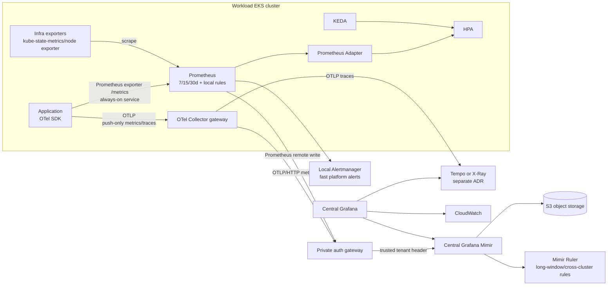

# Advanced Metrics and Telemetry Platform

## 1. 목적과 상태

이 문서는 EKS와 애플리케이션의 metric 수집을 고도화하기 위한 **Target architecture**를 정의합니다. 현재 Terraform 구현은 `kube-prometheus-stack` 기반의 클러스터별 Prometheus, Alertmanager, Grafana와 CloudWatch Observability add-on까지입니다. 아래의 Grafana Mimir, OpenTelemetry Collector, Prometheus Adapter, KEDA는 설계 및 단계적 구축 대상이며 현재 배포 완료를 의미하지 않습니다.

| 구분 | Current | Target |
| --- | --- | --- |
| Kubernetes/infra metric | Prometheus와 CloudWatch Container Insights | Prometheus를 빠른 local scrape/alert 계층으로 유지 |
| Application custom metric | 서비스별 Prometheus endpoint 또는 미정 | OpenTelemetry Metrics API/SDK를 표준으로 하고 실행 profile별 exporter 선택 |
| 장기 metric 저장 | dev/stg/prod Prometheus 7/15/30일 | 중앙 Mimir에 remote write, cross-cluster query와 장기 보존 |
| 대시보드 | 클러스터별 Grafana | 중앙 Grafana에서 Mimir, CloudWatch, 로그/trace backend를 연계 |
| Custom metric HPA | resource metric 중심 | Prometheus Adapter가 승인된 local recording rule만 제공 |
| Event-driven scaling | 미구현 | SQS/Kafka 같은 event source는 KEDA를 선택적으로 사용 |

관련 문서:

- 공통 알람과 workload 사례: [Monitoring and Alerting](monitoring.md)
- EKS SLI/SLO와 운영 기준: [EKS Day-2 Operations](eks-operations.md)
- Agent의 read-only 장애 분석: [Read-Only Agent Incident Triage](agent-incident-triage.md)

## 2. Architecture Decision

### 2.1 채택 기준

1. **Prometheus는 클러스터 생존에 필요한 local control loop를 담당합니다.** scrape, 단기 query, platform alert와 HPA용 recording rule은 WAN 또는 중앙 Mimir 장애에 의존하지 않습니다.
2. **Mimir는 중앙 장기 metric backend를 담당합니다.** 각 클러스터 Prometheus는 remote write하고, push가 필요한 OTel pipeline은 private ingest endpoint로 전송합니다. 중앙 Grafana가 장기 추세와 cross-cluster SLO를 조회합니다.
3. **OpenTelemetry는 애플리케이션 계측 표준입니다.** 신규 서비스는 OTel Metrics API/SDK를 사용합니다. 상시 실행되는 Kubernetes 서비스는 OTel Prometheus exporter로 local scrape 경로를 유지하고, short-lived/push-only workload만 OTLP를 사용합니다. 기존 Prometheus client/exporter는 즉시 재작성하지 않습니다.
4. **CloudWatch는 AWS native signal의 source of truth를 유지합니다.** ALB, RDS, NAT Gateway 등 AWS service metric을 비용을 들여 Mimir에 전부 복제하지 않고 Grafana multi-data-source로 함께 조회합니다.
5. **Autoscaling source는 용도별로 분리합니다.** resource metric은 Metrics Server, service custom metric은 Prometheus Adapter, queue/event source는 KEDA가 담당합니다.
6. 한 metric을 Prometheus scrape와 OTel remote write로 동시에 수집하지 않습니다. 서비스별 `telemetry_mode`를 정해 이중 수집, 중복 alert와 비용 증가를 방지합니다.

### 2.2 목표 흐름



Mimir는 Prometheus remote write를 받는 장기 저장 계층입니다. 개발 PoC는 monolithic mode로 시작할 수 있지만 production은 component별 독립 확장이 가능한 distributed mode를 기본으로 검토합니다. Mimir 자체에는 인증 계층이 포함되지 않으므로 private ingress 앞의 인증 gateway가 workload identity를 검증하고 tenant를 주입해야 합니다. 관련 동작은 Grafana의 [deployment modes](https://grafana.com/docs/mimir/latest/references/architecture/deployment-modes/), [architecture](https://grafana.com/docs/mimir/latest/get-started/about-grafana-mimir-architecture/), [authentication and authorization](https://grafana.com/docs/mimir/latest/manage/secure/authentication-and-authorization/)을 기준으로 검증합니다.

## 3. Metric Source와 도구 선택

| Metric 종류 | 기본 수집기/SDK | 저장·조회 | 제어 용도 | 선택 이유 |
| --- | --- | --- | --- | --- |
| Pod CPU/memory resource | Metrics Server | 장기 저장하지 않음 | HPA resource metric, `kubectl top` | 빠르고 단순한 Kubernetes resource API |
| Kubernetes object state | kube-state-metrics | local Prometheus → Mimir | alert, dashboard | Deployment/PDB/HPA/PVC 상태의 표준 exporter |
| Node/container runtime | kubelet/cAdvisor, node exporter, Container Insights | Prometheus/Mimir와 CloudWatch | capacity, saturation | Kubernetes와 AWS 관점을 함께 유지 |
| AWS managed service | CloudWatch native metric | CloudWatch | alert, dashboard | 원본 해상도와 AWS dimension 유지 |
| 신규 always-on application | **OpenTelemetry Metrics API/SDK + Prometheus exporter** | local Prometheus → Mimir | SLI, alert, HPA 후보 | vendor-neutral 계측과 local control loop 유지 |
| Short-lived/push-only application | **OpenTelemetry Metrics API/SDK + OTLP** | OTel Collector → Mimir | SLI, 분석; HPA에는 직접 사용하지 않음 | scrape가 어려운 workload 수집 |
| 기존 Prometheus application | Prometheus client `/metrics` | local Prometheus → Mimir | SLI, alert, 분석 | migration 비용 없이 표준화 단계 진입 |
| HPA용 service custom metric | Prometheus recording rule | Prometheus Adapter | HPA `custom.metrics.k8s.io` | 중앙 backend 장애와 장기 query 지연에서 분리 |
| SQS/Kafka/event backlog | **KEDA source-native scaler** | source API, 필요 시 별도 관측 metric | event-driven HPA | backlog source를 직접 조회하고 scale-to-zero/fallback 적용 가능 |
| CloudWatch custom metric | 예외 승인 | CloudWatch | AWS alarm 또는 AWS-native integration | 고유 dimension 비용과 중복 pipeline을 사전 검토 |

따라서 이 포트폴리오의 “custom metric” 기본 답은 **서비스 코드에는 OpenTelemetry Metrics API/SDK, 중앙 저장에는 Mimir, Kubernetes HPA 노출에는 Prometheus Adapter, queue 기반 scaling에는 KEDA**입니다. exporter는 always-on 서비스면 Prometheus scrape, short-lived workload면 OTLP를 선택합니다. CloudWatch custom metric은 AWS-native alarm이 꼭 필요한 signal에 한해 예외적으로 사용합니다.

Kubernetes `autoscaling/v2` HPA는 custom metric API와 external metric API를 사용할 수 있습니다. Prometheus Adapter는 Prometheus series/query를 Kubernetes custom/external metric API로 변환합니다. KEDA는 event source를 감시해 HPA를 구동합니다. 구현 시 [Kubernetes HPA](https://kubernetes.io/docs/concepts/workloads/autoscaling/horizontal-pod-autoscale/), [Prometheus Adapter](https://github.com/kubernetes-sigs/prometheus-adapter), [KEDA scaling deployments](https://keda.sh/docs/latest/concepts/scaling-deployments/)를 릴리스 기준으로 확인합니다.

## 4. OpenTelemetry 수집 기준

### 4.1 Deployment pattern

- always-on 서비스 SDK는 OTel Prometheus exporter의 `/metrics` endpoint를 local Prometheus에 노출합니다. 이렇게 수집한 metric은 local alert/HPA와 Mimir remote write가 같은 series를 사용합니다.
- short-lived 또는 scrape가 어려운 workload만 metric을 OTLP/gRPC 또는 OTLP/HTTP로 같은 클러스터의 Collector gateway에 전송합니다. 이 경로의 metric은 local HPA signal로 사용하지 않습니다.
- Collector gateway는 dev에서 최소 2 replica, production에서 3개 AZ에 최소 3 replica와 PDB `minAvailable: 2`, topology spread, resource request/limit와 autoscaling을 적용합니다.
- node-local file, host 또는 kubelet 수집이 꼭 필요한 receiver만 DaemonSet agent를 사용합니다. 모든 애플리케이션에 sidecar를 기본 배치하지 않습니다.
- 기존 Prometheus exporter도 local Prometheus가 scrape합니다. migration 중에는 signal별 owner와 exporter mode를 catalog에 기록합니다.
- 같은 instrument를 Prometheus exporter와 OTLP exporter로 동시에 내보내지 않습니다. OTLP metric을 Collector에서 local Prometheus endpoint로 다시 노출하는 예외는 temporality, restart와 duplicate series를 부하 시험한 뒤 승인합니다.
- 로그는 현재 Fluent Bit → CloudWatch/OpenSearch 경로를 유지합니다. OTel log 전환은 drop, multiline, PII filter와 비용을 검증한 별도 ADR 이후 수행합니다.
- trace backend는 Tempo 또는 X-Ray 중 하나를 별도 결정합니다. metric에 trace exemplar를 남길 수 있게 trace ID correlation은 유지하되, Mimir가 trace 저장소를 대신하지 않습니다.

OpenTelemetry Collector는 receiver, processor, exporter로 telemetry pipeline을 구성합니다. Collector의 [deployment patterns](https://opentelemetry.io/docs/collector/deployment/)과 [component model](https://opentelemetry.io/docs/collector/components/)을 기준으로 구성합니다.

### 4.2 필수 pipeline control

| 단계 | 필수 control | 목적 |
| --- | --- | --- |
| Receiver | OTLP endpoint private exposure, TLS/mTLS, request size 제한 | 비인가 telemetry와 과대 payload 차단 |
| Enrichment | `resource`, `k8sattributes` | cluster/namespace/workload/release context 표준화 |
| Protection | `filter`, `transform`, redaction 정책 | PII/secret와 금지 attribute 제거 |
| Stability | `memory_limiter`, `batch`, queue/retry | OOM과 일시적 backend 장애의 drop 완화 |
| Export | private auth gateway endpoint, timeout, retry, tenant mapping | Mimir 직접 공개와 tenant spoofing 방지 |
| Self-observation | accepted/refused/dropped, queue size, export failure, memory/CPU | Collector 자체 장애를 서비스 장애와 구분 |

Collector의 queue는 무한 buffer가 아닙니다. 최대 outage 허용 시간과 ingest rate로 queue 용량을 산정하고, 초과 시 drop을 알람화합니다. `memory_limiter`는 메모리 보호 수단이지 유실 방지 수단이 아니므로 exporter failure, retry exhaustion, refused/dropped signal을 함께 감시합니다.

Critical gateway에는 persistent sending queue를 검토하되 queue volume도 KMS encrypted StorageClass, 용량/사용률 알람과 복구 시험 대상에 포함합니다. production receiver, debug endpoint와 Collector image hardening은 OpenTelemetry의 [security guidance](https://opentelemetry.io/docs/security/)를 따릅니다.

## 5. Custom Metric Catalog

### 5.1 naming과 attribute 원칙

- HTTP, RPC, database 등 공통 signal은 OpenTelemetry semantic convention 이름과 단위를 우선 사용합니다. 예: `http.server.request.duration` histogram.
- 사내 business metric은 충돌하지 않는 조직 namespace를 사용합니다. 이 포트폴리오는 예시로 `portfolio.notification.*`을 사용합니다.
- 단위는 metric name에 `seconds`, `milliseconds`, `bytes`를 중복 표기하지 않고 instrument metadata에 기록합니다.
- `http.route`는 `/notifications/{template}` 같은 low-cardinality route template만 허용하고 raw URL/path를 넣지 않습니다.
- `request_id`, `trace_id`, 사용자 ID, 전화번호, 이메일, 메시지 ID, 원문 URL, exception message는 metric attribute로 금지합니다. trace 연결은 exemplar를 사용합니다.
- `service.name`, `deployment.environment.name`, `cloud.region`, `k8s.cluster.name`, `k8s.namespace.name`, `k8s.workload.name`, `service.version`은 Collector에서 신뢰 가능한 resource attribute로 보강합니다.
- 배포 전 예상 active series를 계산하고 owner, 목적, retention, dashboard/alert/HPA 소비자를 catalog에 등록합니다. 소비자가 없는 metric은 수집하지 않습니다.
- OTel logical name과 Prometheus exporter/OTLP translation 이후의 PromQL name을 catalog에 함께 기록합니다. dot, unit, Counter `_total` suffix 변환은 배포한 SDK/exporter 설정의 golden test 결과로 확정합니다.

OpenTelemetry의 [metric semantic conventions](https://opentelemetry.io/docs/specs/semconv/general/metrics/)과 [HTTP metrics](https://opentelemetry.io/docs/specs/semconv/http/http-metrics/)를 naming 기준으로 사용합니다.

### 5.2 예약 알림 서비스 예시

| Metric | Instrument / unit | 허용 attribute | 사용처 |
| --- | --- | --- | --- |
| `http.server.request.duration` | Histogram / `s` | `http.request.method`, templated `http.route`, `http.response.status_code` | API latency SLI와 route별 병목 |
| `http.server.active_requests` | UpDownCounter / `{request}` | method, route | Nginx/application saturation |
| `portfolio.notification.accepted` | Counter / `{notification}` | channel, result | 접수량과 acceptance ratio |
| `portfolio.notification.completed` | Counter / `{notification}` | channel, result class | 발송 완료율 SLI |
| `portfolio.notification.retry` | Counter / `{notification}` | provider, bounded reason class | provider 오류와 retry storm |
| `portfolio.notification.dlq.enqueued` | Counter / `{notification}` | bounded reason class | 신규 DLQ 유입과 데이터 누락 위험 page |
| `portfolio.notification.dlq.depth` | ObservableGauge / `{message}` | queue alias | 현재 DLQ 미처리량 |
| `portfolio.notification.queue.depth` | ObservableGauge / `{message}` | queue alias | backlog와 capacity |
| `portfolio.notification.queue.oldest_age` | ObservableGauge / `s` | queue alias | 비동기 처리 SLO와 KEDA 검증 |
| `portfolio.notification.provider.request.duration` | Histogram / `s` | provider, result class | Kakao dependency latency |
| `portfolio.notification.duplicate` | Counter / `{notification}` | channel, bounded cause | post-peak business invariant |

`result`, `reason`, `provider`, `channel`, `queue` 값은 사전 등록한 enum만 허용합니다. provider response text나 동적인 queue URL을 label로 사용하지 않습니다. 완료율, 오류율, p95/p99는 애플리케이션이 Gauge로 직접 내보내지 않고 Counter/Histogram에서 PromQL recording rule로 계산합니다.

Machine-readable Target 예시는 [`config/monitoring/metric-catalog.example.json`](../config/monitoring/metric-catalog.example.json)에 둡니다. 실제 service owner와 PromQL translation evidence가 없는 example 상태이므로 production 등록으로 간주하지 않습니다.

### 5.3 cardinality budget

초기 guardrail은 다음과 같이 두고 2~4주 baseline 이후 workload별로 조정합니다.

| 범위 | 초기 guardrail | 초과 처리 |
| --- | --- | --- |
| Metric attribute | custom attribute 최대 8개, 각 값의 집합을 catalog에 등록 | CI lint 또는 Collector filter로 거부 |
| Service | active series 10,000 이하 | 신규 label/metric rollout 중단 및 owner review |
| Namespace | active series 50,000 이하 | top-cardinality dashboard와 비용 review |
| Tenant | ingest/active-series/query limit 명시 | Mimir per-tenant limit과 budget alert 적용 |

숫자는 universal 성능 한계가 아니라 이 프로젝트의 초기 비용·운영 guardrail입니다. 실제 제한은 부하 시험에서 sample rate, replica 수, histogram bucket, HA duplicate, retention과 query 동시성을 함께 측정해 승인합니다.

## 6. Mimir 운영 설계

### 6.1 topology와 storage

| 환경 | Deployment | local Prometheus | Mimir retention 목표 | 비고 |
| --- | --- | --- | --- | --- |
| dev | monolithic PoC 허용 | 7일 | 30일 | 기능·cardinality·복구 검증 전용 |
| stg | production과 같은 distributed shape의 축소형 | 15일 | 90일 | upgrade와 load test |
| prod | distributed, multi-AZ, zone-aware 검토 | 30일 | 400일 | 연간 capacity/SLO trend; 비용 승인 필요 |

- 현재 단일 Prometheus replica/PVC는 HA가 아닙니다. production Target은 2 replica, anti-affinity/topology spread, PDB를 적용하고 `cluster`와 `__replica__` external label을 일관되게 설정해 Mimir에서 HA sample을 deduplicate합니다.
- S3 bucket은 중앙 observability 또는 log archive 계정에 두고 Block Public Access, versioning, KMS encryption과 access log를 적용합니다. 활성 block 삭제는 Mimir Compactor retention이 담당하며, S3 lifecycle이 임의로 활성 object를 먼저 삭제하지 않게 합니다.
- Mimir release에서 사용하는 ingest architecture와 Kafka/MSK 같은 추가 dependency는 chart/version 검증 후 ADR에 고정합니다. 추가 message layer를 채택하면 그 계층도 availability, backup, upgrade와 비용 대상입니다.
- compactor, store gateway, ruler, Alertmanager와 query path의 AZ 배치, disruption budget, resource request/limit를 정의합니다.
- Mimir block과 bucket metadata를 임의 삭제하지 않습니다. retention 변경과 tenant 폐기는 ticket, data owner 승인, dry-run inventory와 복구 가능성 확인 후 수행합니다.
- production 보존 400일은 법적·감사 보존 기준이 아니라 연간 capacity/SLO 추세를 위한 초기 목표입니다. active series와 object/query 비용을 측정하지 못한 상태에서는 완료로 선언하지 않습니다. Mimir retention은 tenant 단위이므로 metric별 보존이 다르면 별도 tenant/pipeline ADR이 필요합니다.

Retention과 Prometheus HA remote-write는 Mimir의 [metrics retention](https://grafana.com/docs/mimir/latest/configure/configure-metrics-storage-retention/)과 [HA deduplication](https://grafana.com/docs/mimir/latest/configure/configure-high-availability-deduplication/) 문서를 기준으로 구현합니다.

### 6.2 tenant와 인증

- tenant 단위는 기본적으로 `<aws-account-id>:<environment>:<data-domain>`으로 정하고, 중앙 platform metric은 별도 tenant로 분리합니다. 데이터 접근권한이 다른 팀은 label이 아니라 tenant를 분리합니다.
- auth gateway는 mTLS/SPIFFE 또는 승인된 workload identity로 cluster를 식별합니다.
- gateway는 client가 보낸 `X-Scope-OrgID`를 제거한 뒤 identity-to-tenant allowlist 결과를 주입합니다. application 또는 Collector가 임의 tenant를 선택하게 하지 않습니다.
- Grafana service account도 dashboard folder/team과 tenant query 권한을 일치시킵니다. cross-tenant query는 중앙 SRE의 승인된 dashboard와 incident role에만 허용합니다.
- remote-write, query, ruler, admin endpoint를 network policy와 별도 listener/path policy로 구분합니다.
- tenant별 ingestion rate/burst, active series, series per metric, label name/value 길이, query range/concurrency/fetched bytes와 ruler group/series 제한을 명시합니다. production에서 `unlimited`를 기본값으로 두지 않습니다.

### 6.3 local과 central rule ownership

| Rule | 실행 위치 | 이유 |
| --- | --- | --- |
| NodeNotReady, collector down, remote-write failure | local Prometheus/Alertmanager | 중앙 연결 장애 중에도 탐지 |
| API fast burn, queue age 즉시 임계치 | local Prometheus/Alertmanager | 낮은 지연과 cluster 자율성 |
| 6h/3d/30d SLO burn, cross-cluster capacity | Mimir Ruler | 장기 data와 중앙 view 필요 |
| HPA recording rule | local Prometheus | autoscaling을 WAN/Mimir 장애에서 분리 |

같은 조건을 local과 Mimir에서 동시에 page하지 않습니다. 모든 alert rule은 `owner`, `service`, `severity`, `runbook_url`, `source_rule` label을 가지며 Alertmanager에서 deduplicate/inhibit합니다.

### 6.4 필수 platform metric

- Prometheus remote-write pending/failed/retried/dropped sample과 WAL/queue 상태
- Prometheus HA replica의 `cluster`/`__replica__` external label과 Mimir HA deduplication 상태
- OTel Collector accepted/refused/dropped data, exporter error, retry queue, process memory/CPU
- tenant별 Mimir ingest sample rate, active series, rejected sample과 limit usage
- distributor/ingester error와 restart, query/query-frontend latency·error·queue
- compactor failure/backlog, store-gateway sync, ruler evaluation failure
- object storage 4xx/5xx, KMS deny와 요청/저장 비용
- Grafana datasource/query error와 Alertmanager notification failure
- Mimir 외부 CloudWatch synthetic/deadman에서 remote-write endpoint와 on-call path의 생존 상태

### 6.5 capacity와 비용 기준

- 배포 전 최소 2~4주 동안 active series, samples/sec, scrape/export byte, remote-write byte, query p95/p99, rule evaluation time과 현재 비용을 측정합니다.
- `samples/sec ≈ active series / scrape interval`을 1차 입력으로 쓰되 histogram bucket, HA replica와 recording rule이 만드는 추가 series를 포함합니다.
- Mimir sizing과 S3 비용은 고정 bytes/sample 가정으로 확정하지 않고 dev/stg에서 실제 compressed block, request, KMS, cross-AZ/network와 query compute를 측정합니다.
- tenant/team별 active series, ingest, storage와 query 사용량을 비용에 귀속하고 budget 80% Warning, 100% Critical 및 전주 대비 급증을 알람화합니다.
- Mimir dual-write와 query/alert parity, backlog recovery, 비용 evidence가 확보되기 전에는 현재 local Prometheus 7/15/30일 보존을 줄이지 않습니다.

## 7. Autoscaling 안전 기준

### 7.1 Prometheus Adapter

HPA에 raw series 전체를 공개하지 않습니다. `hpa:` prefix를 가진 승인된 recording rule만 Adapter allowlist에 등록합니다.

예시:

```promql
hpa:notification_queue_oldest_age_seconds:max_over_2m
```

- Counter는 `rate()` 또는 windowed backlog/work-per-pod로 변환합니다.
- sparse metric, global aggregate, raw p99, batch 종료 후 사라지는 series를 단독 scale signal로 사용하지 않습니다.
- metric freshness, zero/missing semantics, minimum traffic와 stabilization window를 정의합니다.
- HPA에 여러 metric을 쓰면 각 metric의 권장 replica 중 최대값이 선택되는 동작을 load test로 검증합니다.

### 7.2 KEDA

- SQS visible message, oldest age, Kafka lag처럼 source-native backlog가 있으면 KEDA scaler를 우선합니다.
- authentication은 Kubernetes Secret의 장기 AWS key가 아니라 EKS Pod Identity/IRSA 같은 workload identity를 사용합니다.
- `minReplicaCount`, `maxReplicaCount`, polling/cooldown, activation threshold, fallback replica와 failure threshold를 명시합니다.
- scale-out이 downstream provider quota, subnet IP, node/EC2 quota, database connection pool을 초과하지 않도록 upper bound를 함께 설정합니다.
- KEDA/HPA가 같은 Deployment를 서로 다른 release 또는 Terraform state에서 중복 소유하지 않게 합니다.

## 8. 권한과 보안 경계

Linux 사용자 계정에 monitoring용 Kubernetes `ClusterRole`을 직접 추가하지 않습니다. 사람의 접근은 Corporate IdP → IAM Identity Center → EKS Access Entry와 승인된 Kubernetes group으로 연결하고, 수집 component는 전용 Kubernetes ServiceAccount와 workload identity를 사용합니다.

| Principal | 필요한 최소 권한 | 금지/제한 |
| --- | --- | --- |
| Prometheus ServiceAccount | 승인 namespace/endpoints의 get/list/watch, metric scrape | Secret read, workload mutation |
| OTel Collector ServiceAccount | `k8sattributes`에 필요한 pod/namespace/node metadata read; 선택 receiver별 최소 권한 | Secret/config 내용 수집, cluster-admin |
| Prometheus Adapter ServiceAccount | Prometheus query와 aggregated API serving에 필요한 권한 | workload mutation, 임의 Mimir admin query |
| KEDA operator | ScaledObject 관리와 대상 HPA 생성, source별 workload identity | static AWS key, 광범위한 AWS read |
| Mimir writer | 자기 tenant remote write | query/admin, 다른 tenant write |
| Grafana reader | 승인 folder/datasource/tenant query | ruler/admin 변경 |
| Monitoring Agent | versioned query catalog 기반 read-only query | arbitrary PromQL, cross-tenant, dashboard/rule 변경 |

Metric attribute에는 개인정보를 넣지 않으며, Mimir tenant는 보안 boundary를 보조하지만 별도의 AWS account/network/IAM 경계를 대체하지 않습니다.

## 9. Agent Incident Triage 연계

Monitoring Agent는 Mimir/Grafana 관리자 권한을 받지 않습니다. AI Gateway와 Tool Broker가 다음을 강제합니다.

- query는 repository에 versioning된 catalog ID와 parameter만 허용합니다.
- tenant, environment, cluster, 최대 lookback, step, series 수, 반환 byte를 server side에서 고정합니다.
- dashboard 링크는 반환할 수 있지만 datasource credential, raw header와 secret은 모델에 노출하지 않습니다.
- metric label, annotation과 Grafana title/tag는 비신뢰 telemetry입니다. 길이와 문자 allowlist를 적용해 JSON evidence로 전달하고, 그 안의 명령·URL·shell 문자열을 실행하거나 추가 query로 변환하지 않습니다.
- cross-tenant query와 long-range/high-cardinality query는 별도 incident role과 승인으로 제한합니다.
- 모든 query는 `request_id`, `trace_id`, user, tenant, query catalog version, time range와 결과 크기를 감사합니다.
- Agent 결과는 사실, 가설, 추가 evidence, confidence를 분리하고 자동 remediation이나 production 변경으로 이어지지 않습니다.

## 10. 단계별 구현과 완료 증적

| Phase | 작업 | 완료 evidence |
| --- | --- | --- |
| 0. Baseline | current series/sample/cardinality/query/비용 측정, metric owner catalog 작성 | 2~4주 baseline과 승인된 budget |
| 1. OTel dev | 한 서비스에 OTel SDK와 HA Collector gateway 적용 | 부하 중 drop 0, backend outage/retry test, PII scan |
| 2. Mimir PoC | dev monolithic, S3, private auth gateway, Prometheus/OTel remote write | tenant 격리 음성 테스트, query/restart/restore test |
| 3. stg distributed | distributed topology, multi-AZ failure, limit, upgrade, cost test | AZ/component failure game day와 capacity report |
| 4. prod rollout | cluster 단위 canary remote write, 중앙 Grafana/Ruler, on-call route | local alert 독립성, SLO/retention/KMS/cost evidence |
| 5. autoscaling | Adapter allowlist와 필요한 service의 KEDA | stale/missing metric, source outage, max capacity load test |

Production readiness gate:

- [ ] Current와 Target을 구분했고 실제 배포 artifact/endpoint/version을 inventory에 기록했다.
- [ ] 모든 metric에 owner, 목적, instrument, unit, allowed attribute, retention과 소비자가 있다.
- [ ] tenant spoofing, cross-tenant query, PII/secret 유입에 대한 음성 테스트를 통과했다.
- [ ] Prometheus/Collector/Mimir/Grafana 자체 health alert와 독립된 notification route가 있다.
- [ ] local alert와 HPA가 central Mimir 또는 WAN 장애 중에도 동작한다.
- [ ] remote-write/Collector outage에서 queue, retry, drop과 recovery 시간을 부하 시험했다.
- [ ] Mimir AZ failure, component restart, object-store/KMS error와 upgrade rollback을 검증했다.
- [ ] active series, ingest, storage, query, network 비용이 tenant/team에 귀속되고 budget alert가 있다.
- [ ] Prometheus Adapter/KEDA의 stale·missing metric, source outage와 `maxReplicas` 동작을 검증했다.
- [ ] dashboard, recording rule, alert, Collector config와 runbook이 Git/PR/CI로 변경된다.

## 11. Terraform/GitOps 구현 경계

Target 구현 시 다음 ownership을 사용합니다.

| Artifact | 권장 owner/state |
| --- | --- |
| Central S3/KMS/private endpoint와 Mimir infrastructure | observability foundation Terraform state |
| Mimir/Collector/Adapter/KEDA Helm release와 CRD | cluster platform Terraform 또는 GitOps state |
| ServiceMonitor/PodMonitor, OTel instrumentation config | application release state |
| Recording/alert rule, dashboard, metric catalog | 별도 observability config repository 또는 명확한 단일 GitOps owner |
| HPA/ScaledObject | application release state |

한 Helm release, CRD, dashboard 또는 rule을 Terraform과 GitOps가 동시에 소유하지 않습니다. `prod` 배포는 plan/diff, chart와 image digest, change ticket, approver, rollback artifact를 검증하는 protected CI/CD만 수행합니다.
