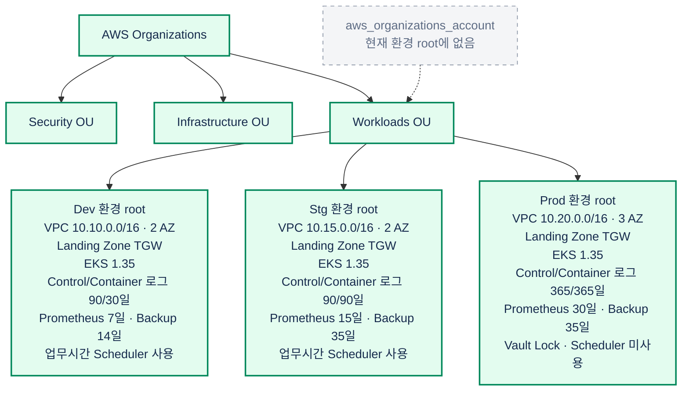
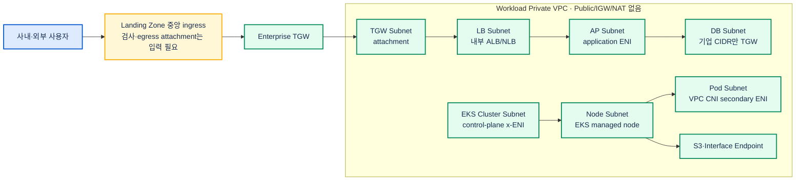
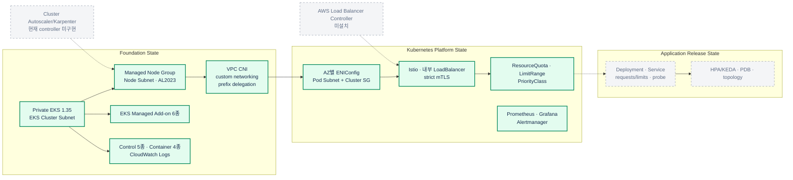
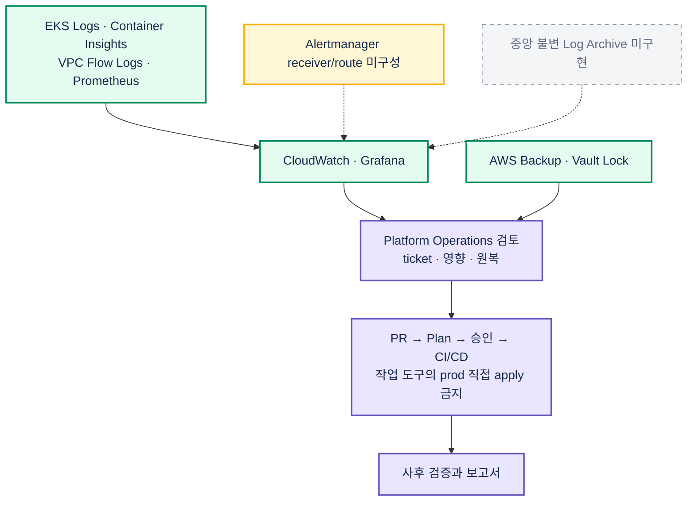
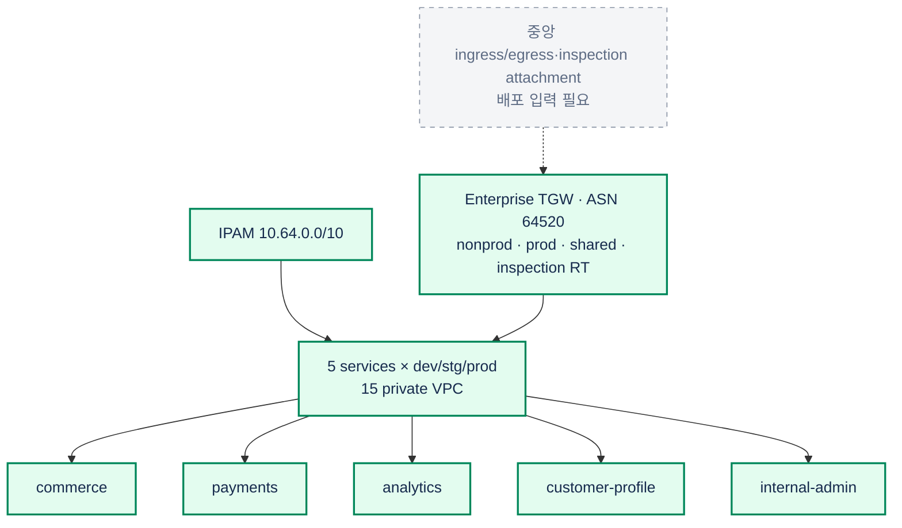
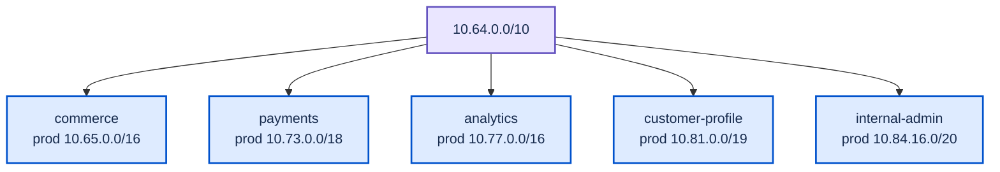
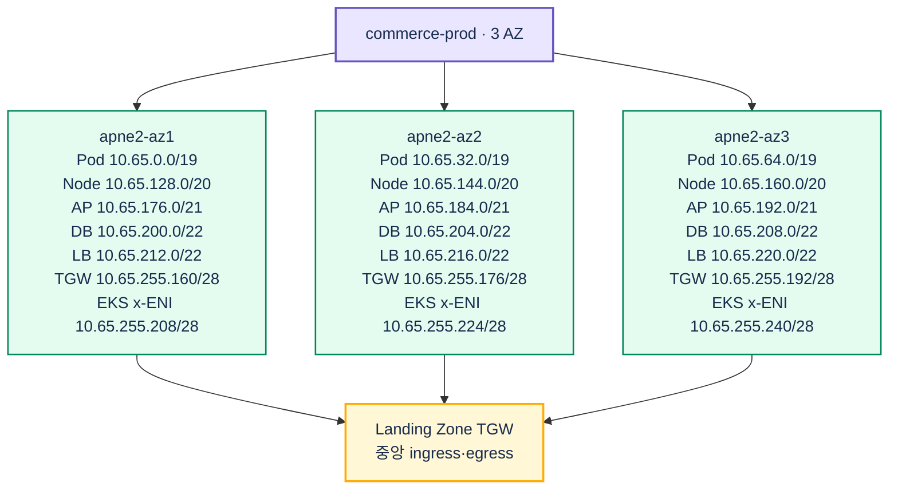

# Terraform 코드 기준 AWS 인프라 구성도

현재 `terraform/` 구현을 Mermaid로 표현합니다. 초록은 코드 구현, 노랑은 외부 입력·검증 필요, 회색 점선은 미구현 목표입니다.

## 1. AWS Organizations와 환경 경계

## 2. 환경별 VPC와 통신 흐름

LB/AP/Node/Pod/EKS Cluster subnet의 기본 경로는 TGW를 향합니다. DB subnet에는 인터넷 기본 경로가 없습니다.

## 3. EKS 상태와 플랫폼 소유권

Terraform이 `desired_size` drift를 무시하는 것은 autoscaler 설치를 뜻하지 않습니다.

## 4. 관측·운영·변경 통제 흐름

## 5. 서비스 Landing Zone과 Transit Gateway

## 6. IPAM과 서비스별 VPC 크기

## 7. 서비스 VPC의 AZ별 Subnet 예시

`commerce-prod 10.65.0.0/16`의 Terraform 계산 결과입니다.

환경 입력이나 subnet 계산을 변경하면 Terraform 코드, Mermaid, 검색용 tree와 draw.io 원본을 함께 검토합니다.
